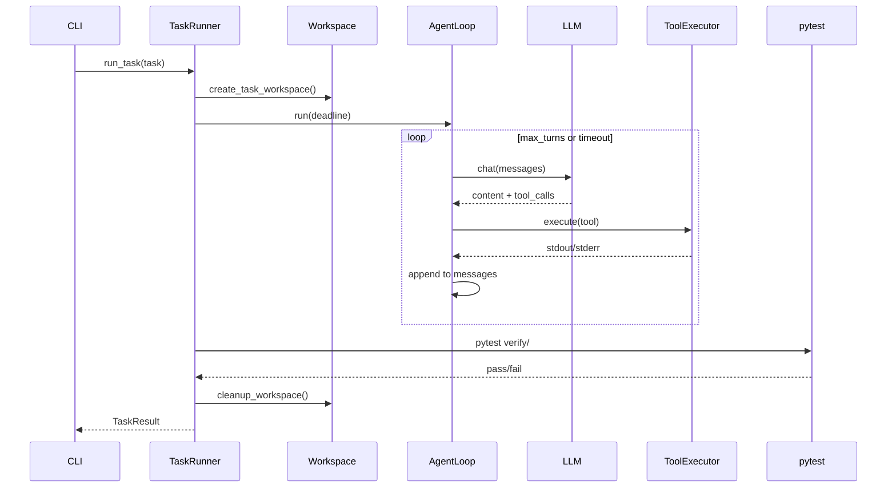

# Agent Eval 技术文档

## 1. 背景与目标

### 1.1 问题

本地部署的大语言模型（如 Qwen3.8-27B 4bit 量化版）接入 Agent 工作流后，常出现以下问题：

- 单轮对话表现尚可，但多轮工具调用场景下明显「变傻」
- 缺乏可复现、可量化的对比手段，难以判断是量化、thinking 配置还是 Agent 框架的问题
- 现有 benchmark（SWE-bench、HumanEval）要么太慢，要么不测 Agent 能力

### 1.2 设计目标

| 目标 | 说明 |
|------|------|
| **Agent 导向** | 评测多轮读/写/运行/调试，而非单轮代码补全 |
| **快速** | quick profile 10 个任务，目标约 30 分钟跑完 |
| **本地友好** | 对接 llama.cpp / vLLM 等 OpenAI 兼容 API |
| **可对比** | 支持 thinking preset 矩阵，输出通过率 + 耗时 + token |
| **可诊断** | 保存完整 trajectory，定位失败步骤 |

### 1.3 核心指标

- **pass@1**：pytest 验证通过率
- **耗时**：总时长、单任务时长、每轮 LLM 延迟
- **轮次**：Agent 交互轮数
- **reasoning tokens**：thinking 模式下的推理 token 用量（若 API 返回）

---

## 2. 系统架构

### 2.1 总体架构

```
┌─────────────┐     ┌──────────────┐     ┌─────────────────┐
│   CLI       │────▶│  EvalConfig  │────▶│   TaskRunner    │
│ agent-eval  │     │  (YAML+CLI)  │     │  (per task)     │
└─────────────┘     └──────────────┘     └────────┬────────┘
                                                  │
                    ┌─────────────────────────────┼─────────────────────────────┐
                    ▼                             ▼                             ▼
           ┌────────────────┐           ┌─────────────────┐           ┌─────────────────┐
           │ Temp Workspace │           │   AgentLoop     │           │  pytest verify  │
           │ (任务隔离副本)  │◀─────────▶│  + ToolExecutor │──────────▶│  (客观判定)     │
           └────────────────┘           └────────┬────────┘           └─────────────────┘
                                                │
                                                ▼
                                       ┌─────────────────┐
                                       │   LLMClient     │
                                       │ OpenAI-compat   │
                                       └─────────────────┘
```

### 2.2 目录结构

```
llm_agentic_code_eval/
├── config/default.yaml          # 默认配置（API、preset、profile）
├── docs/TECHNICAL.md            # 本文档
├── src/agent_eval/
│   ├── cli.py                   # 命令行入口
│   ├── config.py                # 配置加载与数据类
│   ├── llm/client.py            # OpenAI 兼容客户端
│   ├── agent/
│   │   ├── loop.py              # Agent 多轮循环
│   │   ├── tools.py             # 工具执行器
│   │   └── parser.py            # 工具调用解析
│   ├── harness/
│   │   ├── runner.py            # 单任务编排
│   │   └── workspace.py         # 工作区隔离
│   ├── tasks/registry.py        # 任务注册
│   └── report/reporter.py       # 报告生成
├── tasks/<task_id>/             # 任务 fixture
│   ├── task.yaml
│   ├── workspace/               # 初始代码（给模型）
│   └── verify/test_task.py      # 验证测试（不给模型）
└── tests/                       # 框架单元测试
```

### 2.3 模块职责

| 模块 | 文件 | 职责 |
|------|------|------|
| CLI | `cli.py` | 解析参数，调度 `run` / `matrix` / `list-tasks` |
| Config | `config.py` | 加载 YAML，合并 CLI 覆盖，解析 thinking preset 与 profile |
| LLM | `llm/client.py` | 封装 OpenAI SDK，注入 `reasoning_effort` / `extra_body` |
| Agent | `agent/loop.py` | 多轮对话循环，解析工具调用，维护消息历史 |
| Tools | `agent/tools.py` | 在隔离 workspace 内执行 read/write/edit/run |
| Harness | `harness/runner.py` | 串联 Agent → 验证 → 报告，管理生命周期 |
| Tasks | `tasks/registry.py` | 扫描 `tasks/` 目录，加载 `task.yaml` |
| Report | `report/reporter.py` | 生成 `summary.json` / `summary.md` |

---

## 3. 评测流程

### 3.1 单次评测（`agent-eval run`）



### 3.2 单任务生命周期

1. **准备**：将 `tasks/<id>/workspace/` 复制到临时目录
2. **Agent 阶段**：模型根据 `task.yaml` 中的 `prompt` 多轮调用工具修改代码
3. **验证阶段**：对临时目录运行 `tasks/<id>/verify/` 下的 pytest（`PYTHONPATH` 指向 workspace）
4. **清理**：删除临时目录，保存 trajectory 到 `results/.../trajectories/<id>.json`
5. **判定**：`passed = (pytest 通过) AND (无运行时异常)`

### 3.3 超时与终止条件

| 条件 | `stop_reason` | 行为 |
|------|---------------|------|
| 模型输出 `DONE:` 且无工具调用 | `done` | 正常结束 Agent 阶段，进入验证 |
| 达到 `max_turns`（默认 20） | `max_turns` | 停止 Agent，仍执行验证 |
| 超过 `task_timeout_sec`（默认 240s） | `timeout` | 停止 Agent，仍执行验证 |
| 模型未调用工具且非 DONE | `no_tool_call` | 提前结束 |
| 运行时异常 | `error` | 记录 error，标记失败 |

> 注意：无论 Agent 如何结束，都会执行 pytest 验证。这是 pass@1 的客观判定基础。

---

## 4. Agent 设计

### 4.1 工具集

| 工具 | 参数 | 说明 |
|------|------|------|
| `read_file` | `path` | 读取 workspace 内文件 |
| `write_file` | `path`, `content` | 创建或覆盖文件 |
| `edit_file` | `path`, `old`, `new` | 精确替换一处文本（`old` 必须唯一匹配） |
| `run_command` | `command` | 在 workspace 内执行 shell 命令 |

### 4.2 安全约束

- **路径沙箱**：所有文件操作经 `_resolve_path()` 校验，禁止路径穿越（`../` 逃逸）
- **命令黑名单**：拦截 `rm -rf /`、fork bomb 等危险模式
- **命令超时**：`run_command` 默认 60s 超时（不超过任务总超时）
- **工作区隔离**：每任务独立临时目录，互不污染

### 4.3 工具调用协议

本地量化模型往往做不好原生 function calling，因此提供两种模式：

#### 模式 A：text（默认）

模型在回复中输出 ` ```tool ` 代码块，内容为 JSON：

```tool
{"name": "read_file", "arguments": {"path": "counter.py"}}
```

由 `agent/parser.py` 中的正则 `r"```tool\s*\n?(.*?)\n?```"` 解析。工具结果以 `user` 角色回传：

```
Tool result for read_file:
<file content>
```

此模式对 llama.cpp 量化模型最稳定。

#### 模式 B：openai

走 OpenAI `tools` API + `tool` 角色消息，适合 vLLM 等支持 FC 的后端。通过 `--tool-mode openai` 启用。

### 4.4 消息历史结构

```
[system]  Agent 指令 + 工具说明
[user]    任务 prompt（来自 task.yaml）
[assistant] 模型回复（可能含 tool 块）
[user]    工具结果（text 模式）
[assistant] ...
[tool]    工具结果（openai 模式）
```

---

## 5. LLM 客户端

### 5.1 OpenAI 兼容封装

`LLMClient` 基于 `openai` Python SDK，通过 `base_url` 指向本地服务：

```python
client = OpenAI(base_url="http://localhost:8080/v1", api_key="EMPTY")
response = client.chat.completions.create(model=..., messages=..., ...)
```

### 5.2 Thinking / Reasoning 配置

支持两条路径，由 `reasoning_backend` 配置项选择：

#### 路径 1：reasoning_effort（Qwen3.8 + llama.cpp）

请求体顶层字段：

```json
{
  "model": "Qwen3.8-27B",
  "messages": [...],
  "reasoning_effort": "low"
}
```

可选值：`low` | `medium` | `xhigh`

#### 路径 2：chat_template_kwargs（vLLM Qwen3 fallback）

```json
{
  "extra_body": {
    "chat_template_kwargs": {"enable_thinking": false}
  }
}
```

#### 路径 3：thinking_token_budget

```json
{
  "extra_body": {
    "thinking_token_budget": 512
  }
}
```

### 5.3 Preset 解析优先级

```
CLI --reasoning-effort  >  CLI --thinking-preset  >  config default_thinking_preset
```

`config/default.yaml` 中定义的 preset：

| Preset | 实际请求参数 |
|--------|-------------|
| `off` | `enable_thinking: false` |
| `low` | `reasoning_effort: low` |
| `medium` | `reasoning_effort: medium` |
| `xhigh` | `reasoning_effort: xhigh` |
| `budget_512` | `thinking_token_budget: 512` |

### 5.4 指标采集

每次 `chat()` 调用记录：

- `latency_sec`：端到端延迟
- `prompt_tokens` / `completion_tokens` / `total_tokens`
- `reasoning_tokens`：从 `usage.completion_tokens_details.reasoning_tokens` 提取（若 API 支持）

---

## 6. 任务体系

### 6.1 任务目录规范

每个任务是一个独立目录：

```
tasks/<task_id>/
├── task.yaml          # 元数据
├── workspace/         # 初始代码（复制给模型）
└── verify/            # pytest 测试（模型不可见）
    └── test_task.py
```

### 6.2 task.yaml 字段

```yaml
prompt: |             # 给模型的任务描述（必填）
  Fix the bug in counter.py ...
verify_cmd: pytest verify/ -q   # 备用验证命令
timeout_sec: 240       # 单任务超时（秒）
max_turns: 20          # 最大 Agent 轮次
```

### 6.3 Profile 分组

在 `config/default.yaml` 的 `profiles` 中定义任务集合：

| Profile | 任务数 | 预计耗时 | 用途 |
|---------|--------|----------|------|
| `smoke` | 3 | ~10 min | 冒烟测试、调试框架 |
| `quick` | 10 | ~30 min | 常规模型对比 |

### 6.4 任务列表与能力覆盖

| 任务 ID | 考察能力 | 难度 |
|---------|----------|------|
| `fix_counter_bug` | 读代码 + 看报错 + 修 off-by-one | 易 |
| `implement_parse_log` | 按规格实现函数 | 易 |
| `fix_failing_test` | 实现代码让测试通过 | 中 |
| `add_retry_decorator` | 实现装饰器并应用 | 中 |
| `fix_import_cycle` | 解循环依赖 | 中 |
| `implement_lru_cache` | 数据结构实现 | 中 |
| `cli_csv_stats` | CLI 工具开发 | 中 |
| `refactor_extract_func` | 重构保持行为不变 | 中 |
| `debug_async_race` | async 竞态修复 | 难 |
| `multi_file_api` | 多文件 FastAPI 补全 | 难 |

### 6.5 验证机制

- 验证测试放在 `verify/` 目录，**不复制到 workspace**，模型无法直接读取
- pytest 以 workspace 为 `cwd`，`PYTHONPATH=workspace`
- 通过 = 所有 `verify/test_task.py` 中的断言成立
- 任务语言统一为 **Python**，避免 C++ 编译开销

---

## 7. 报告系统

### 7.1 输出目录结构

```
results/
└── 20260909_220000/           # 或 matrix/low/
    ├── summary.json           # 机器可读完整报告
    ├── summary.md             # 人类可读表格
    └── trajectories/
        ├── fix_counter_bug.json
        └── ...
```

### 7.2 summary.json 结构

```json
{
  "model": "Qwen3.8-27B",
  "base_url": "http://localhost:8080/v1",
  "thinking_label": "reasoning_effort=low",
  "profile": "quick",
  "pass_rate": 0.7,
  "total_sec": 1692.5,
  "results": [
    {
      "task_id": "fix_counter_bug",
      "passed": true,
      "agent_turns": 3,
      "total_elapsed_sec": 45.2,
      "stop_reason": "done",
      "total_reasoning_tokens": 128,
      "trajectory": [...]
    }
  ]
}
```

### 7.3 矩阵对比（`agent-eval matrix`）

对多个 thinking preset 依次执行完整评测，生成：

```
results/matrix/
├── low/summary.md
├── medium/summary.md
├── xhigh/summary.md
└── matrix_summary.md    # 横向对比表
```

---

## 8. 配置参考

### 8.1 完整配置项

| 配置项 | 默认值 | 说明 |
|--------|--------|------|
| `base_url` | `http://localhost:8080/v1` | API 地址 |
| `model` | `Qwen3.8-27B` | 模型名称 |
| `api_key` | `EMPTY` | API 密钥 |
| `reasoning_backend` | `reasoning_effort` | thinking 注入方式 |
| `default_thinking_preset` | `low` | 默认 preset |
| `tool_mode` | `text` | 工具调用协议 |
| `profile` | `quick` | 任务分组 |
| `task_timeout_sec` | `240` | 单任务超时 |
| `max_turns` | `20` | 最大 Agent 轮次 |
| `temperature` | `0.2` | 采样温度 |
| `max_tokens` | `4096` | 单次最大生成 token |
| `seed` | `null` | 随机种子（可选） |

### 8.2 CLI 参数覆盖

CLI 参数优先级高于 YAML 配置文件。常用组合：

```bash
# 指定模型与 thinking
agent-eval run --base-url http://localhost:8080/v1 \
  --model Qwen3.8-27B --thinking-preset medium

# 覆盖单个任务
agent-eval run --tasks fix_counter_bug --max-turns 10

# 矩阵对比
agent-eval matrix --presets off,low,medium,xhigh --profile quick
```

---

## 9. 扩展指南

### 9.1 添加新任务

1. 创建 `tasks/<new_task_id>/` 目录
2. 编写 `task.yaml`（prompt + 超时）
3. 在 `workspace/` 放入初始代码
4. 在 `verify/test_task.py` 编写 pytest 测试
5. 将任务 ID 加入 `config/default.yaml` 的 profile
6. 本地验证：手动修复 workspace 后运行 `pytest tasks/<id>/verify -q`

### 9.2 添加新 thinking preset

在 `config/default.yaml` 的 `thinking_presets` 中添加：

```yaml
thinking_presets:
  budget_1024:
    extra_body:
      thinking_token_budget: 1024
```

### 9.3 适配其他模型后端

| 后端 | 建议配置 |
|------|----------|
| llama.cpp (Qwen3.8) | `tool_mode: text`, `reasoning_backend: reasoning_effort` |
| vLLM (Qwen3) | `tool_mode: openai`, `reasoning_backend: chat_template` |
| 无 thinking 模型 | `thinking_preset: off` |

---

## 10. 设计决策与取舍

### 10.1 为什么不选 SWE-bench

- 真实 GitHub issue + Docker，单任务 10-30+ 分钟
- 本地 27B 量化模型跑完全集需数天
- 更适合云端大模型，不适合本地快速迭代

### 10.2 为什么不选 HumanEval

- 单轮函数补全，不测工具调用链
- 无法反映 Agent 场景中「读文件 → 运行 → 看报错 → 再改」的能力

### 10.3 为什么用 Python 任务

- 无编译步骤，验证快（pytest 秒级）
- 降低评测噪声，让结果主要反映模型 Agent 能力而非构建工具链

### 10.4 为什么默认 text 协议

- 本地 4bit 量化模型的 function calling 格式遵循率差
- 文本 ` ```tool ` 块对格式要求低，实测在 llama.cpp 上更可靠

### 10.5 已知局限

| 局限 | 说明 |
|------|------|
| pass@1 only | 不支持多次采样取 pass@k |
| 无并行 | 任务串行执行，未利用 vLLM 批处理 |
| 无 Docker | 安全性依赖路径沙箱，非容器隔离 |
| 语言单一 | 仅 Python，不含 C++/Rust 等 |
| 测试不可见 | 模型看不到 verify/，部分任务可能靠猜测 |

---

## 11. 故障排查

### 11.1 连接失败

```
openai.APIConnectionError: Connection refused
```

检查本地服务是否启动、`base_url` 端口是否正确。

### 11.2 模型不调用工具

- 确认 `--tool-mode text`（llama.cpp 默认）
- 查看 `trajectories/<task>.json`，检查模型输出格式
- 尝试提高 `max_tokens` 或降低 `temperature`

### 11.3 通过率低但单轮能力强

典型 Agent 失败模式（查 trajectory 定位）：

1. 不运行 pytest，直接声明完成
2. `edit_file` 的 `old` 字符串不匹配
3. 不看 stderr，重复相同错误修改
4. 修改了错误文件

### 11.4 thinking 对比无差异

- 确认 API 确实支持 `reasoning_effort`（用 curl 验证）
- 检查 `summary.json` 中 `thinking_label` 是否正确
- 查看 `reasoning_tokens` 是否为 0（可能 API 未返回）

---

## 12. 依赖

| 包 | 用途 |
|----|------|
| `openai` | OpenAI 兼容 API 客户端 |
| `pyyaml` | 配置文件解析 |
| `rich` | CLI 终端输出 |
| `pytest` | 任务验证 |
| `fastapi` + `httpx` | `multi_file_api` 任务依赖 |

Python >= 3.10。
